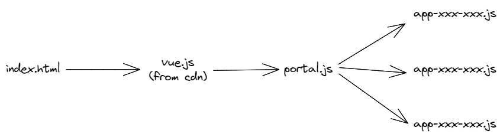

# Vue Remote Component Demo

基于 Vue3 的远程组件加载 Demo。

## 启动

```sh
sh build.sh
```

## 加载流程



## 实现要点

- 所有 app 组件导出为 esm 模块
    - 构建时，Vue 加入 external
    - app 需要用的依赖，比如 element-plus 需要在 portal 应用中先注册
- portal 中创建一个 Vue 实例
    - 远程组件包装在 AppLoader 组件中，由其内部加载组件
    - import 语句要加上 `/* @vite-ignore */` 防止被 vite 处理
    - 构建时，Vue 加入 external
- 缺少的依赖（vue），通过 import-maps 映射到 cdn 上的 vue.esm-browser.prod.js

## 潜在问题

- 低版本浏览器不支持 import-maps，可以使用 systemjs 代替
    - systemjs 是一个 import 实现。相对于 amd 格式，systemjs 可以更好地控制加载的顺序，使用体验几乎与 import 一致
    - systemjs 通过插件也可以支持 amd 格式
- 从远程加载的代码，是直接执行，大概率存在安全问题
- 有全局污染问题，可能是 js 也可能是 styles

## LICENSE

MIT
